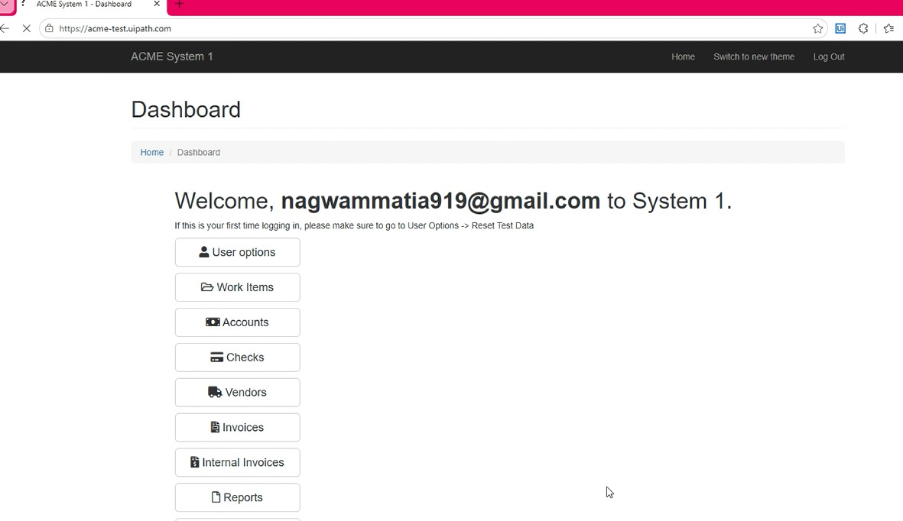
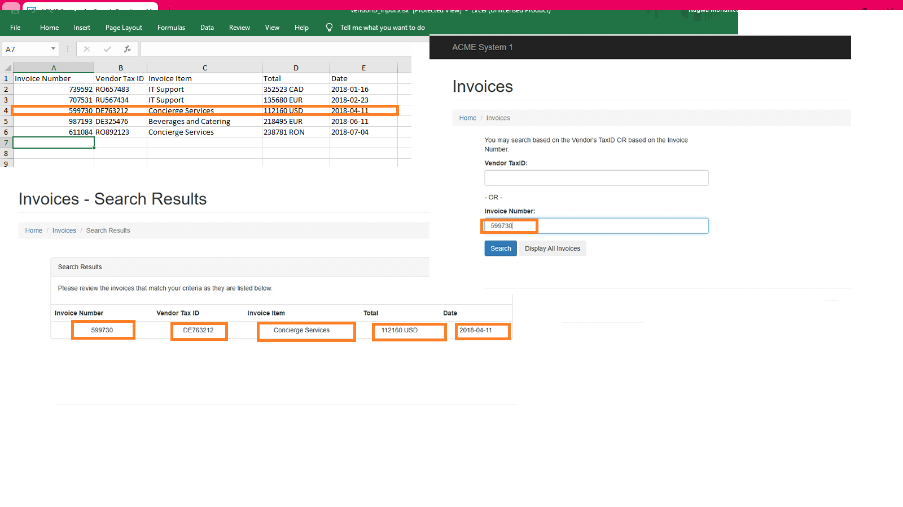

# UiPath Invoice Extraction Automation.

## Overview
This project automates invoice data extraction from the ACME System website using UiPath Modern Design Experience.

## The automation:
- Reads invoice numbers from Excel.
- Logs into ACME System.
- Searches invoices.
- Extracts invoice details.
- Updates the Excel file automatically.


 ## Technologies
- UiPath Studio
- Modern Design Experience
- UI Automation
- Excel Automation
- Selectors
- DataTables

## Workflow Process

1. Read invoice numbers from Excel
2. Login to ACME website
3. Navigate to invoice search page
4. Search each invoice number
5. Extract:
   - Vendor Tax ID
   - Invoice Item
   - Total
   - Date
6. Update Excel file with extracted data
   

# Workflow Architecture

```
Main.xaml
│
├── LoginToAcmeWebsite.xaml
├── NavigateToSearchInvoice.xaml
├── SearchForCurrentInvoice.xaml
├── Extract_InvoiceDetails.xaml
└── NavigateBackToInvoiceSearch.xaml

```

## Technical Challenges & Solutions

### Challenge 1: Dynamic Web Selectors

While extracting invoice details from the ACME website, some UI elements were difficult to identify because multiple elements shared similar attributes.

**Solution**
- Used Strict Selectors whenever possible.
- Added Anchors to uniquely identify table values.
- Simplified selectors to make them more stable and maintainable.
- Reduced dependency on Computer Vision targeting.

Example:

Target:
```
<webctrl tag='TABLE' />
<webctrl tableCol='2' tableRow='2' tag='TD' />
```
Anchor:
```
<webctrl tag='TH' innertext='Vendor Tax ID' />
```

### Challenge 2: Repeated Table Elements

The invoice details page contains multiple table cells with similar structures.

**Solution**
- Used Anchor-based targeting.
- Anchored extracted values to their corresponding column headers.
- Improved extraction accuracy and reduced selector ambiguity.

### Challenge 3: Incorrect Field Targeting

During login automation, the password value was being entered into the email field.

**Solution**
- Re-indicated UI elements.
- Replaced unstable Computer Vision targeting with web selectors.
- Added validation for target elements.

## Features
✔ Modern Design Experience

✔ Excel Automation

✔ UI Automation

✔ DataTable Processing

✔ Selector Optimization

✔ Anchor-Based Extraction

✔ Modular Workflow Design

✔ Exception-Aware Development

## Screenshots

### Main Workflow


### Invoice Search Page



### Output Excel



## Demo
 
